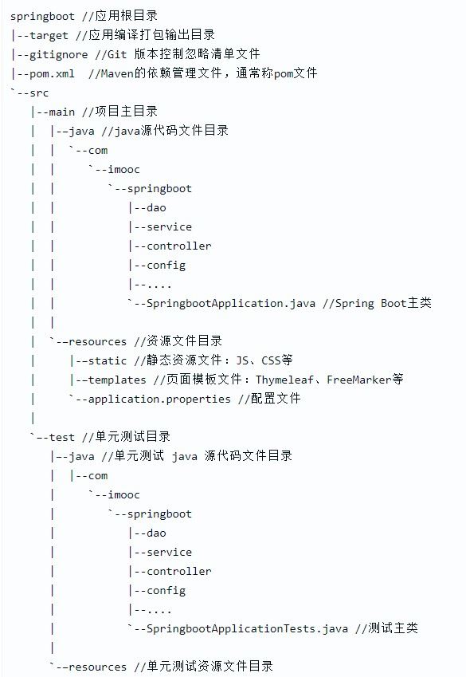

# SpringBootDemo
练手演示项目
### 包含的功能
  * YAML: Spring(以及其他主流Java框架)的[配置文件](SpringBoot常用配置项.yml)。
  * Swagger：一款用于生成、描述、调用和可视化 RESTful 风格的 Web 服务接口文档的框架。优点：与实际代码同步。
  * JPA：通过实体类来映射数据库。用途：用于单表查询。
  * MyBatis: 通过数据库来生成实体类，与JPA是一种互逆的关系。用途：用于多表联合复杂的查询。
  * Redis: 一种NoSQL数据库，相比较传统数据库有着高性能、丰富的数据结构、强大的功能、简单可靠、支持多种语言等特点。通途：缓存、排行榜、计数器、社交网络、消息队列系统、分布式锁。
  * Druid: 数据库连接池。用途：提升速度与稳定性。
  * 日志框架： 在日志门面和日志实现中各选一个，使用SLF4J + Logback的组合。[日志规范](日志规范.md)。注：日志门面是一种设计模式，相当于日志的接口框架，定义了一套标准。

### 目录结构
 
